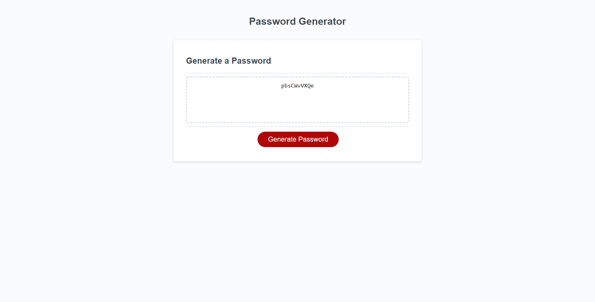

# Password-Generator

## Table of Contents
1. [Description](#description)
2. [Visuals](#visuals)
3. [Resources](#resources)

## Description
- Password generator will generate a random password for you.
- Press the button 'Generate Password' to begin the prompts.
- There are 4 different choices in the prompts, you can pick whichever ones you like.
- The 4 different choices include uppercase letters, lowercase letters, numbers, and special characters.
- The password generator will generate anywhere between 8 and 128 characters for you.

## Visuals

## Resources

[Live Site](https://ntraugh.github.io/Password-Generator/)

[Repository](https://github.com/ntraugh/Password-Generator)